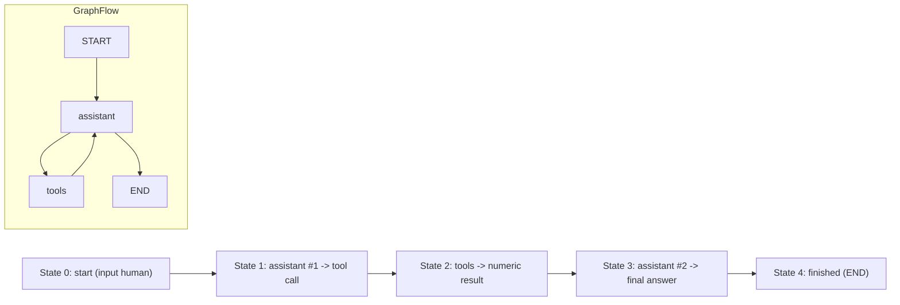

# Time Travel in LangGraph: Detailed Explanation

This document provides a comprehensive explanation of the concepts and techniques demonstrated in the `time-travel.ipynb` notebook from the LangChain Academy module on time travel in LangGraph. The notebook explores LangGraph's powerful debugging and state management features, allowing users to browse, replay, and fork execution histories of graph-based agents.

## Table of Contents
1. [Introduction](#introduction)
2. [Prerequisites](#prerequisites)
3. [Building the Agent](#building-the-agent)
4. [Running the Graph](#running-the-graph)
5. [Browsing History](#browsing-history)
6. [Visualizing States](#visualizing-states)
7. [Replaying](#replaying)
8. [Forking](#forking)
9. [LangGraph API and SDK](#langgraph-api-and-sdk)
10. [LangGraph Studio](#langgraph-studio)
11. [Conclusion](#conclusion)

## Introduction

LangGraph is a framework for building stateful, multi-actor applications with LLMs. One of its advanced features is "time travel," which enables debugging, approval workflows, and state editing by allowing users to:

- **Approval**: Interrupt the graph to surface state for user approval before proceeding.
- **Debugging**: Rewind the graph to reproduce or avoid issues.
- **Editing**: Modify the state at any point and continue execution from there.

The notebook demonstrates these capabilities using a simple arithmetic agent that can perform addition, multiplication, and division operations.

## Prerequisites

### Installations
The notebook installs several packages:
- `langgraph`: Core LangGraph library
- `langchain_openai`: OpenAI integration for LangChain
- `langgraph_sdk`: SDK for interacting with LangGraph servers
- `langgraph-prebuilt`: Pre-built components

```python
%%capture --no-stderr
%pip install --quiet -U langgraph langchain_openai langgraph_sdk langgraph-prebuilt
```

### Environment Setup
The notebook loads an OpenAI API key from a `.env` file:

```python
import os
from dotenv import load_dotenv

env_path = os.path.expanduser("~/.langchain.env")
load_dotenv(dotenv_path=env_path)

openai_api_key = os.getenv("OPENAI_API_KEY")
```

This ensures secure API key management without hardcoding sensitive information.

## Building the Agent

### Tools Definition
The agent uses three simple arithmetic tools:

```python
def multiply(a: int, b: int) -> int:
    """Multiply a and b."""
    return a * b

def add(a: int, b: int) -> int:
    """Adds a and b."""
    return a + b

def divide(a: int, b: int) -> float:
    """Divide a by b."""
    return a / b

tools = [add, multiply, divide]
```

### LLM Configuration
The notebook uses OpenAI's GPT-4o model with tool binding:

```python
from langchain_openai import ChatOpenAI

llm = ChatOpenAI(model="gpt-4o")
llm_with_tools = llm.bind_tools(tools)
```

### Graph Construction
The graph is built using LangGraph's StateGraph with MessagesState:

```python
from langgraph.checkpoint.memory import MemorySaver
from langgraph.graph import MessagesState, START, END, StateGraph
from langgraph.prebuilt import tools_condition, ToolNode

# System message
sys_msg = SystemMessage(content="You are a helpful assistant tasked with performing arithmetic on a set of inputs.")

# Assistant node
def assistant(state: MessagesState):
    return {"messages": [llm_with_tools.invoke([sys_msg] + state["messages"])]}

# Graph setup
builder = StateGraph(MessagesState)
builder.add_node("assistant", assistant)
builder.add_node("tools", ToolNode(tools))

builder.add_edge(START, "assistant")
builder.add_conditional_edges(
    "assistant",
    tools_condition,
)
builder.add_edge("tools", "assistant")

memory = MemorySaver()
graph = builder.compile(checkpointer=MemorySaver())
```

The graph flow is: START → assistant → (conditional: tools if tool call, END if final answer) → tools → assistant → END

### Graph Visualization
The notebook displays the graph structure using Mermaid:

```python
display(Image(graph.get_graph(xray=True).draw_mermaid_png()))
```

## Running the Graph

The agent is executed with an initial input:

```python
initial_input = {"messages": HumanMessage(content="Multiplica 2 y 3")}
thread = {"configurable": {"thread_id": "1"}}

for event in graph.stream(initial_input, thread, stream_mode="values"):
    event['messages'][-1].pretty_print()
```

This runs the graph and prints the message history as it evolves.

## Browsing History

### Current State
To view the current state of the graph:

```python
graph.get_state({'configurable': {'thread_id': '1'}})
```

This returns the latest state, including messages and next steps.

### State History
To browse all prior states:

```python
all_states = [s for s in graph.get_state_history(thread)]
len(all_states)  # Shows number of states
```

The history includes all checkpoints from the execution.

## Visualizing States

The notebook uses a Mermaid diagram to visualize the state transitions:



This diagram shows the progression through states and the underlying graph structure.

## Replaying

Replaying allows running the graph from a previous checkpoint:

```python
to_replay = all_states[-2]  # Get a previous state
to_replay.values  # Inspect the state
to_replay.next    # See next node
to_replay.config  # Get config with checkpoint_id

# Replay from this checkpoint
for event in graph.stream(None, to_replay.config, stream_mode="values"):
    event['messages'][-1].pretty_print()
```

The graph recognizes the checkpoint has been executed and replays from there, showing the same sequence of events.

## Forking

Forking creates a new execution path from a previous state with modified input:

```python
to_fork = all_states[-2]
fork_config = graph.update_state(
    to_fork.config,
    {"messages": [HumanMessage(content='Multiply 5 and 3', 
                               id=to_fork.values["messages"][0].id)]},
)

# Run from the forked checkpoint
for event in graph.stream(None, fork_config, stream_mode="values"):
    event['messages'][-1].pretty_print()
```

This creates a new branch in the execution history, allowing "what-if" scenarios.

## LangGraph API and SDK

The notebook demonstrates time travel using the LangGraph SDK:

### Client Setup
```python
from langgraph_sdk import get_client
client = get_client(url="http://127.0.0.1:2024")
```

### Streaming Runs
```python
thread = await client.threads.create()
async for chunk in client.runs.stream(
    thread["thread_id"],
    assistant_id="agent",
    input=initial_input,
    stream_mode="updates",
):
    # Process streaming updates
```

### Replaying with API
```python
states = await client.threads.get_history(thread['thread_id'])
to_replay = states[-2]
async for chunk in client.runs.stream(
    thread["thread_id"],
    assistant_id="agent",
    input=None,
    stream_mode="updates",
    checkpoint_id=to_replay['checkpoint_id']
):
    # Process replayed events
```

### Forking with API
```python
forked_input = {"messages": HumanMessage(content="Multiply 3 and 3",
                                         id=to_fork['values']['messages'][0]['id'])}

forked_config = await client.threads.update_state(
    thread["thread_id"],
    forked_input,
    checkpoint_id=to_fork['checkpoint_id']
)

# Run forked execution
async for chunk in client.runs.stream(
    thread["thread_id"],
    assistant_id="agent",
    input=None,
    stream_mode="updates",
    checkpoint_id=forked_config['checkpoint_id']
):
    # Process forked events
```

## LangGraph Studio

LangGraph Studio provides a web-based UI for time travel:

1. Start the local server: `langgraph dev` in the `/studio` directory
2. Access the UI at: `https://smith.langchain.com/studio/?baseUrl=http://127.0.0.1:2024`
3. The studio allows visual inspection, replaying, and forking of graph executions

## Conclusion

The time travel feature in LangGraph provides powerful debugging and experimentation capabilities:

- **State Inspection**: View any point in execution history
- **Reproducibility**: Replay executions exactly as they happened
- **Experimentation**: Fork executions to test different inputs or paths
- **Human-in-the-Loop**: Enable approval and editing workflows

These features make LangGraph particularly suitable for building reliable, debuggable AI applications where understanding and controlling execution flow is critical.

The notebook demonstrates both programmatic access via the Python API and interactive exploration through the Studio UI, providing comprehensive coverage of time travel concepts.